# Manual de uso

Work Tracker mide cuánto tiempo pasas frente a cada aplicación de escritorio y guarda el
historial en tu equipo. Este manual recorre la aplicación entera, pantalla por pantalla.

Si todavía no la instalaste, la descarga y los pasos están en el
[README](../README.md#instalación).

## Contenido

1. [La ventana](#la-ventana)
2. [Elegir qué módulos usar](#elegir-qué-módulos-usar)
3. [Manual: cronómetro libre](#manual-cronómetro-libre)
4. [Work: medir aplicaciones](#work-medir-aplicaciones)
5. [Pomodoro](#pomodoro)
6. [Historial](#historial)
7. [Opciones](#opciones)
8. [Bandeja del sistema](#bandeja-del-sistema)

---

## La ventana

La aplicación no usa la barra de título de Windows: dibuja la suya.

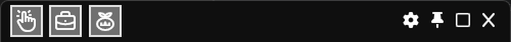

A la izquierda están los tres módulos —**Manual**, **Work** y **Pomodoro**—, cada uno con su
icono. El recuadro resaltado indica que ese módulo está abierto; al hacer clic se abre o se
cierra en el acto.

A la derecha, los controles de la ventana:

| Botón | Qué hace |
|---|---|
| ⚙ | Abre [Opciones](#opciones) |
| 📌 | Mantiene la ventana por encima de otras (ver abajo) |
| ▢ | Maximiza o restaura |
| ✕ | **Oculta la ventana en la bandeja**, no cierra la aplicación |

El botón ✕ no termina la aplicación: la deja corriendo y midiendo, sólo esconde la ventana.
Para cerrarla de verdad hay que usar **Salir** desde la [bandeja](#bandeja-del-sistema).

La ventana crece y se achica sola según los módulos que tengas abiertos: no hace falta
redimensionarla a mano.

### Mantener la ventana a la vista

El botón 📌 ofrece dos formas de fijar la ventana:

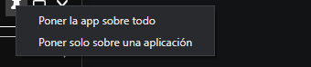

- **Poner la app sobre todo**: la ventana queda por encima de cualquier otra, siempre.
- **Poner solo sobre una aplicación**: eliges una de las ventanas abiertas y Work Tracker se
  pone por delante únicamente cuando esa aplicación está en primer plano. Útil para tenerlo
  visible mientras trabajas en un programa concreto sin que estorbe en el resto.

Volver a pulsar 📌 desactiva la fijación.

## Elegir qué módulos usar

Al abrir la aplicación por primera vez aparece la pantalla de inicio con los tres módulos:

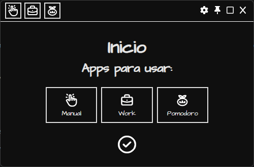

Haz clic en los que quieras usar —se marcan en gris— y confirma con el botón ✓.

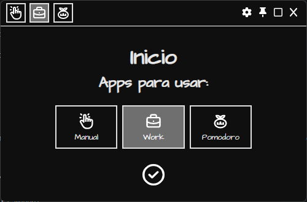

Los tres pueden estar abiertos a la vez; se apilan uno debajo del otro y son independientes
entre sí: el cronómetro manual, la medición automática y el Pomodoro corren en paralelo.

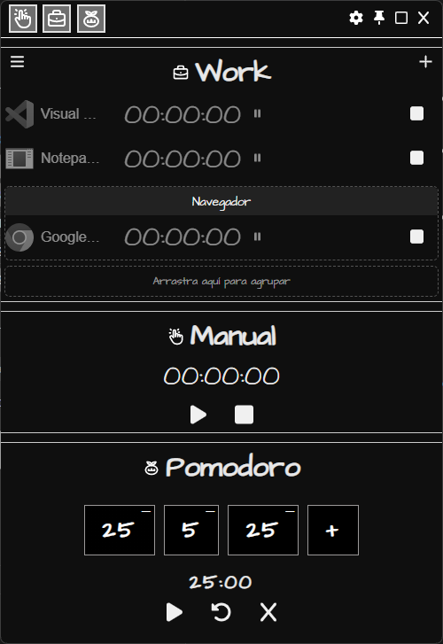

Una vez elegidos, los recuadros de la barra de título son el atajo para abrir y cerrar cada
módulo sin volver a esta pantalla.

## Manual: cronómetro libre

Un cronómetro que arranca y para cuando tú lo dices. No está atado a ninguna aplicación:
sirve para cronometrar cualquier cosa.

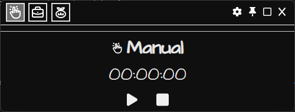

- **▶** arranca. Mientras corre, el botón pasa a **⏸** para pausar sin perder lo acumulado.
- **■** detiene y vuelve a cero.

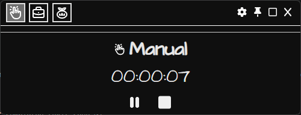

## Work: medir aplicaciones

Este es el módulo central. Mide el tiempo que cada aplicación que elijas pasa **abierta y en
primer plano**: cuando cambias de ventana, la fila anterior se pausa y arranca la que
corresponde.

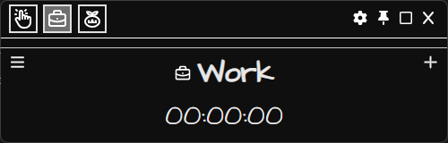

Arranca vacío. El **+** de la derecha abre el selector de aplicaciones; el **☰** de la
izquierda abre el [Historial](#historial).

### Agregar aplicaciones

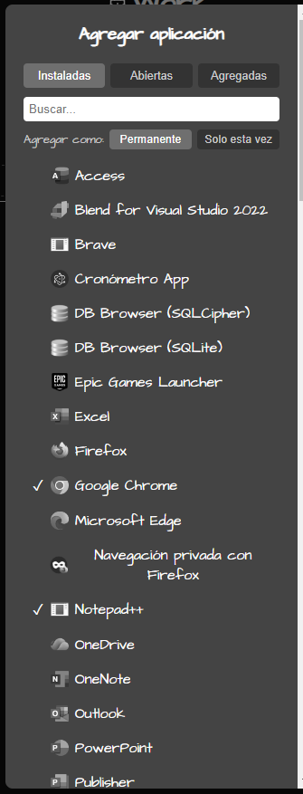

El selector tiene tres pestañas:

- **Instaladas**: todos los programas instalados en el equipo, con su nombre e icono. Es la
  vía habitual: la aplicación no necesita estar abierta para agregarla.
- **Abiertas**: sólo lo que está corriendo en este momento. Útil para algo que no aparece en
  la lista de instaladas.
- **Agregadas**: lo que ya elegiste, para revisarlo o quitarlo.

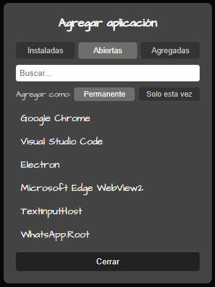

El campo **Buscar…** filtra cualquiera de las tres listas. Un ✓ junto a una entrada indica
que ya está agregada; al pulsarla otra vez se quita.

### Permanente o sólo esta vez

Antes de elegir una aplicación, el conmutador **Agregar como** decide si la selección se
guarda:

- **Permanente**: la aplicación queda en tu lista y vuelve a aparecer la próxima vez que
  abras Work Tracker.
- **Solo esta vez**: se mide durante esta sesión y no se guarda. Las filas agregadas así
  llevan una marca junto al icono.

### Las filas

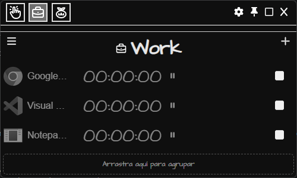

Cada fila muestra el icono de la aplicación, su nombre, el tiempo acumulado, un indicador de
estado y un botón para detenerla:

- **▶ / ⏸** a la derecha del tiempo indica si esa fila está contando o en pausa. Sólo cuenta
  la aplicación que tienes en primer plano; las demás esperan.
- **El nombre se puede editar**: haz clic sobre él, escribe el que prefieras y confirma con
  Enter. `Esc` cancela.
- **■** detiene la fila y la saca del listado.

Se pueden medir **hasta cuatro aplicaciones a la vez**. Al llegar al límite el selector lo
avisa y hay que detener una fila para agregar otra.

### Agrupar aplicaciones

Si varias aplicaciones son parte de lo mismo —el navegador y el editor de un mismo proyecto,
por ejemplo— puedes juntarlas en un grupo y leer su tiempo en conjunto.

Debajo del listado hay una franja que dice **Arrastra aquí para agrupar**. En reposo ocupa
apenas lo que mide su etiqueta; al empezar a arrastrar una fila crece para señalar la zona
donde puedes soltarla:

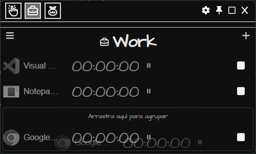

Al soltar, la fila queda dentro de un grupo nuevo:

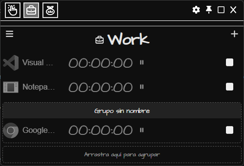

Haz clic en **Grupo sin nombre** para ponerle uno; Enter confirma, `Esc` cancela.

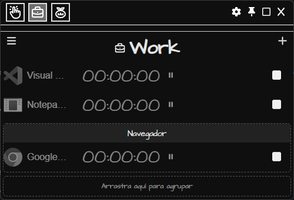

Puedes crear tantos grupos como quieras: la franja sigue disponible debajo del último. Para
mover una fila de un grupo a otro —o sacarla— basta con arrastrarla de nuevo.

## Pomodoro

Un temporizador por sesiones para trabajar en bloques con descansos.

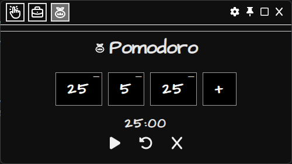

Cada recuadro es una sesión y el número son **minutos**. En el ejemplo: 25 de trabajo, 5 de
descanso y otros 25 de trabajo.

- **+** agrega una sesión al final.
- **Clic sobre un número** lo pone en edición para cambiar la duración; Enter confirma.
- **—** en la esquina de un recuadro elimina esa sesión.
- **Arrastrar** un recuadro lo reordena.

Debajo, el tiempo restante de la sesión en curso y los controles:

| Botón | Qué hace |
|---|---|
| ▶ / ⏸ | Arranca o pausa la cuenta |
| ↺ | Reinicia la sesión actual desde su duración completa |
| ✕ | Cancela toda la secuencia y vuelve al principio |

Cuando una sesión termina suena un aviso y arranca la siguiente. El volumen se ajusta en
[Opciones](#opciones).

## Historial

El botón **☰** del módulo Work abre el historial en una ventana aparte.

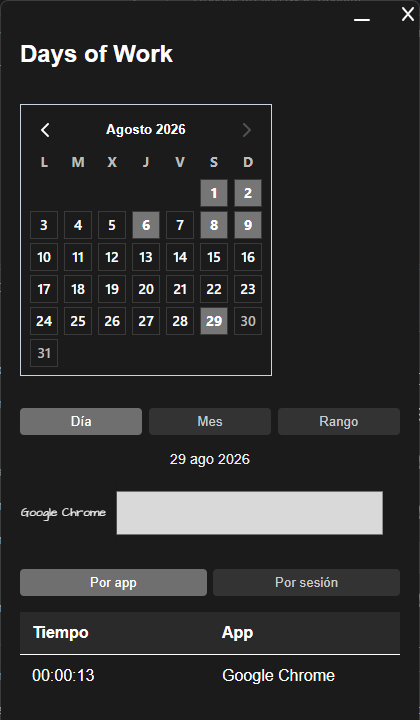

**El calendario** marca los días con actividad registrada. Al hacer clic en uno, el resto de
la ventana pasa a mostrar ese día.

**Día / Mes / Rango** cambia el período del gráfico:

- **Día**: el día seleccionado en el calendario.
- **Mes**: el mes completo.
- **Rango**: abre un segundo calendario para elegir fecha de inicio y de fin.

**El gráfico** reparte el tiempo del período entre las aplicaciones medidas.

Debajo, dos vistas del detalle:

- **Por app** suma todo el tiempo de cada aplicación en el período.
- **Por sesión** lista cada tramo por separado, con la hora de inicio y de fin.

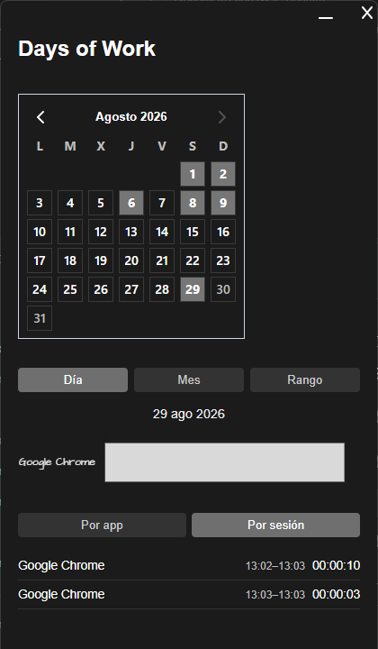

## Opciones

El botón ⚙ de la barra de título abre el panel de ajustes.

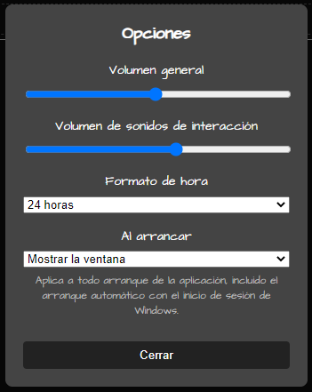

- **Volumen general**: nivel de todos los sonidos de la aplicación.
- **Volumen de sonidos de interacción**: sólo los clics y avisos de la interfaz, sin tocar
  el aviso de fin de sesión del Pomodoro.
- **Formato de hora**: 24 horas o 12 horas. Afecta a las horas del historial.
- **Al arrancar**: si la aplicación abre su ventana o se queda sólo en la bandeja. Vale para
  cualquier arranque, incluido el automático con el inicio de sesión de Windows.

## Bandeja del sistema

Work Tracker vive en la bandeja del sistema, junto al reloj. Si no ves su icono, despliega
los iconos ocultos con la flecha **⌃**.

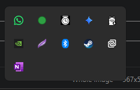

- **Clic izquierdo** muestra la ventana si estaba oculta.
- **Clic derecho** abre el menú:

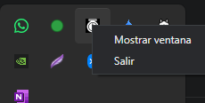

**Salir** es la única forma de terminar la aplicación; el ✕ de la ventana sólo la esconde.

### Arranque con Windows

El instalador ofrece una casilla para que Work Tracker arranque junto con la sesión de
Windows. Si la marcas, la aplicación se abre sola al iniciar sesión, y la opción
**Al arrancar** decide si lo hace mostrando la ventana o quedándose sólo en la bandeja.

---

¿Encontraste algo que este manual no explica, o que no funciona como dice?
[Abre un issue](https://github.com/larayap/work-tracker/issues).
